# BillBoard - *Pay less together*

This is a 2nd year mobile development project for the University of applied sciences - Oulu. 

The idea of the app is to serve as an expense tracker for groups, where they can share their bills \
and keep track of the money flow between the group members. \
The business idea for the project is to serve as a real Billboard for our affiliate partners and \
advertise their products/services to our end-users. Users can find discount codes in the app.
## Authors

- [@Clémence Cunin](https://github.com/clemencecunin)
- [@Alexander Rainov](https://github.com/rainov)

## Features

- Light/dark mode
- Account verification
- Password reset
- Create user groups and add members
- Promote other members to admins of the group, so they have edit rights
- Newly registered users have available all groups they were added to, prior registration
- Balance sheet for each group, tracking the money flow between everybody in the group
- Upload receipts for expenses
- Save money with Affiliate partner's deals
- Personal QR codes for each user

## Technologies used

- Programming language - KOTLIN Version: 211-1.6.10-release-923-AS7442.40
- Backend - Google Firebase
- IDE - Android studio Bumblebee (2021.1.1 Patch 2)
- Android toolkit - Jetpack Compose
- External libraries used - `Coil` for async image loading and `zXing` for QR code generating.

## Devices used for testing

- Android studio emulator - Pixel 5
- Physical device - OnePlus 7pro

## Firebase

Expense collection structure - Each expense is storing the groupID for the group that holds it, and thats how the app sorts them.
##
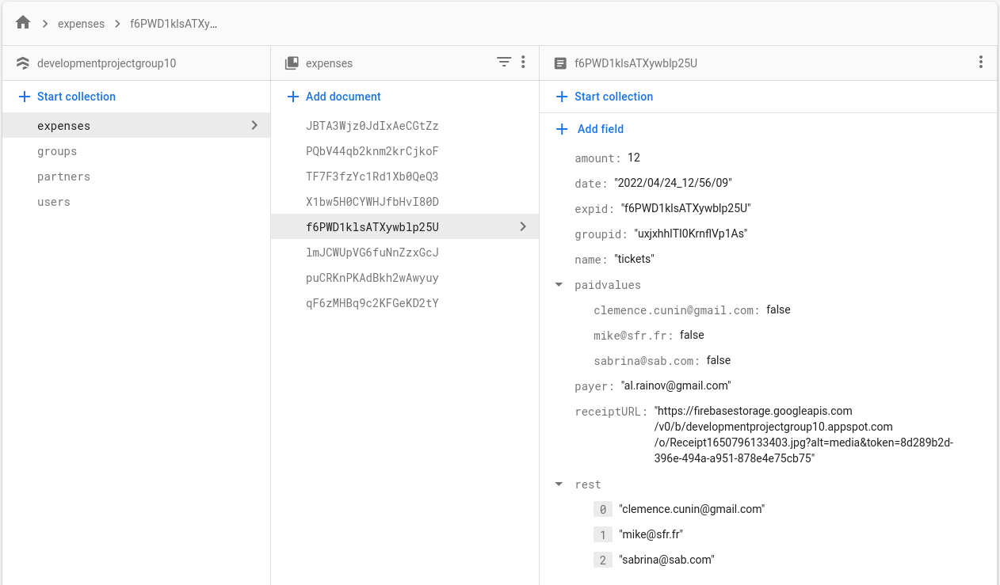
##
Groups collection structure - Each group holds an array with all related expenses and each expense is affecting the group balance.
##
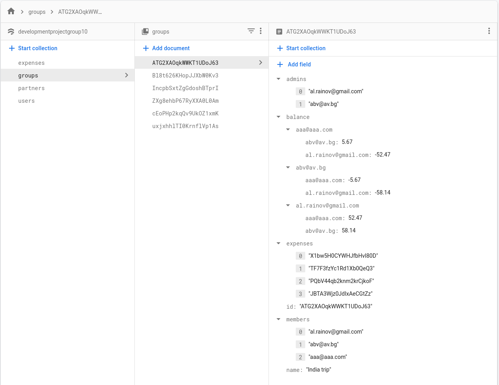
##
Partners collection structure - Very basic description, name, category and image URL from Firebase firestore.
##

##
Users colection structure - Holds the username and a LOG for all user actions made by the user, with unique identifier - FID.
##
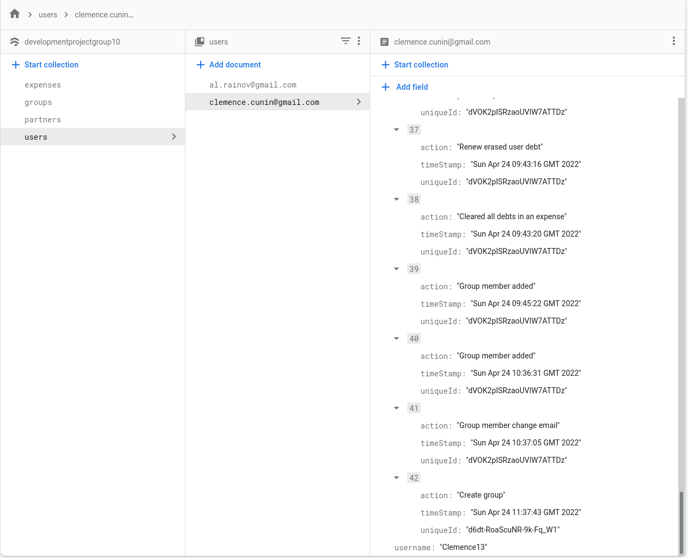

## Screenshots

Log in View - First view displayed when the user open the app for the first time. It allows the user to log in with his email and password, to switch to register view and to reset its password. The password can be visible by clicking the eye icon.
##
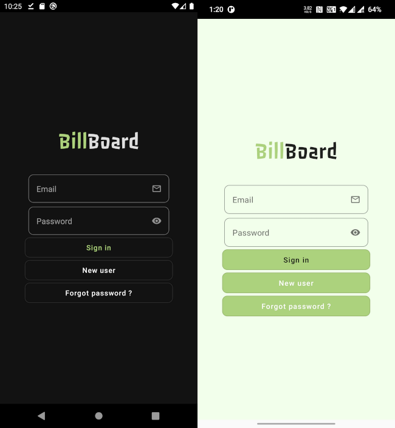
##
Register View - This view allows the user to register in the application with his username, email and password. The password can be visible by clicking the eye icon. Pressing the "Register" button will open an alert dialog informing the user to validate his email.
##

##
Main Screen View - The main screen for a logged in user. The user can see the list of every group he's in. The "+" icon on the bottom right redirects to the Create Group View. Each group card is clickable and redirects to the corresponding Group View. On the top left, the user can open the Main Screen Drawer View.
##
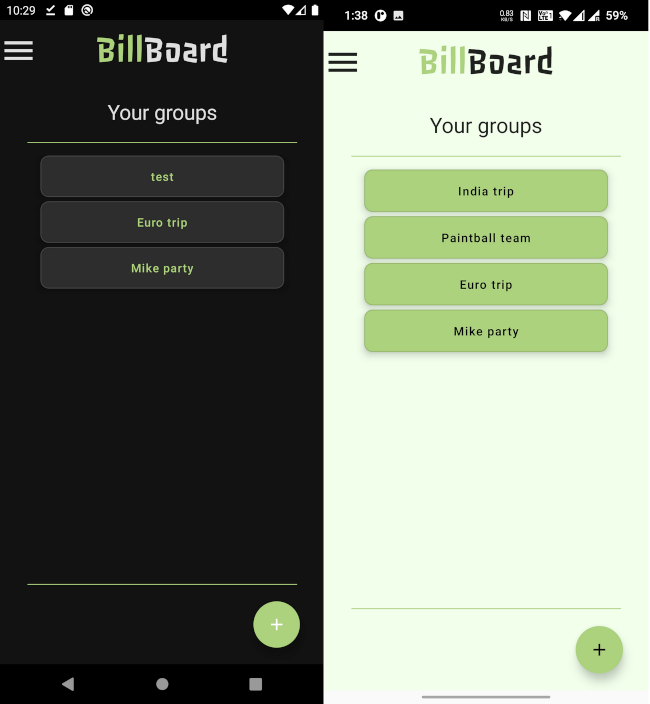
##
Main Screen Drawer View - This hamburger menu allows the user to access the Save Money View (Business part of the project), the About Us View and the Settings View.
##

##
Save Money View - This view is related to the project's business part. The affiliate companies are sorted in three categories : "Group Activities", "Shopping" and "Travel". Each of these cards redirects to the corresponding Save Money Category View.
##
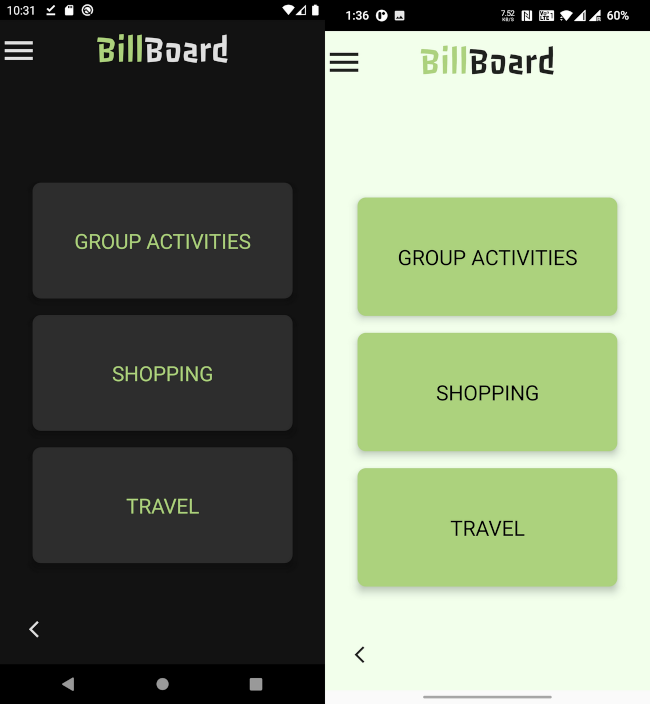
##
Save Money Category View - The user can see the list of the affiliate partners. Each logo card leads to the Discount Page View corresponding to the chosen company.
##
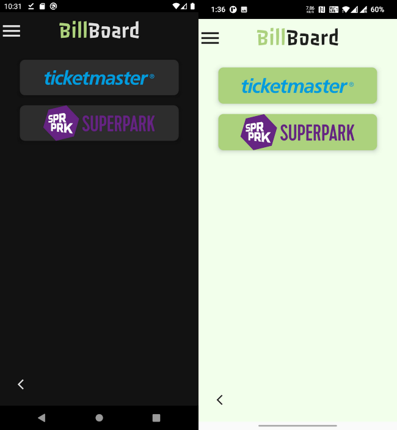
##
Discount Page View - This view displays a QRCode that the user can use when buying from the partners company.
##
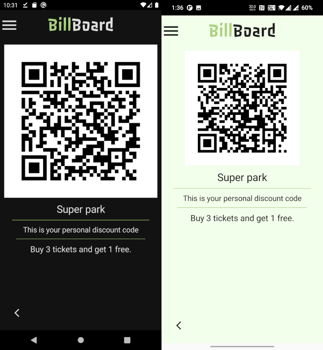
##
About Us View - This view displays some information about the application and a link to the Github repository.
##
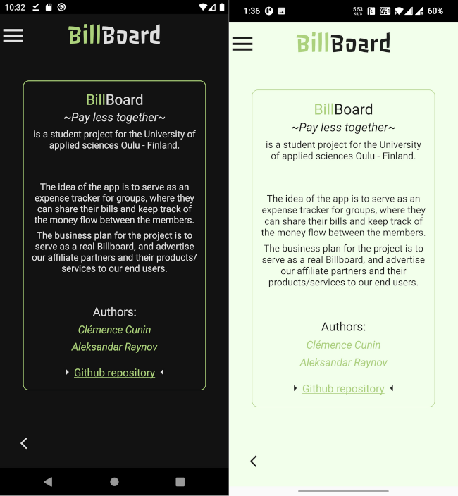
##
Settings View - This view allows the user to see his username and to modify it. He can also reset his password, sign out, change the application theme and exit the settings. The delete account button is not yet implemented.
##

##
Create Group View - This view allows the user to create another group by entering its name. By pressing the submit button, the user will be redirected in the Empty Group View.
##

##
Empty Group View - This view allows the user to add members to the group by pressing the "Add members" button, he will be redirected to the Edit Member View. The "Delete" button delete the whole group.
##
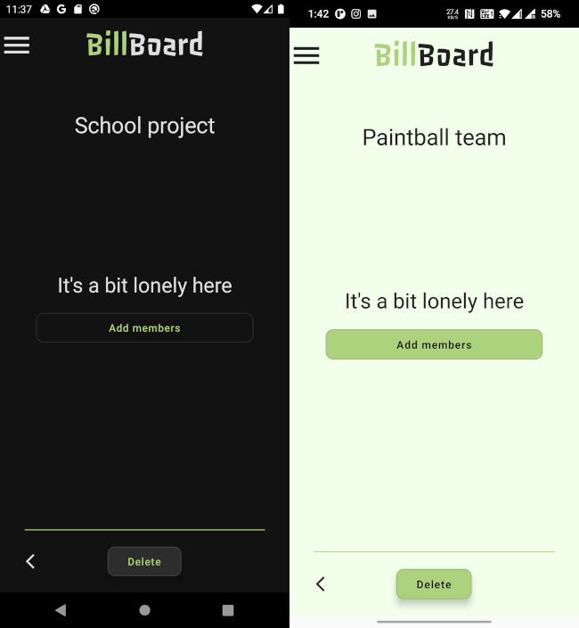
##
Group View - This view is accessible if there is more than one member in the group or at least one expense. The user can see the list of all the group expenses. He can access the Group Balance View by pressing the corresponding button on the top. Each expense card is clickable and leads to the corresponding Expense View. If the user can add a new expense by pressing the "+" button on the bottom right corner and is redirected to the Add Expense View. If the user is an admin, he can delete the whole group. When an expense is fully paid, the color of the card change. The user can open the Group Drawer View by clicking on the top left corner icon.
##
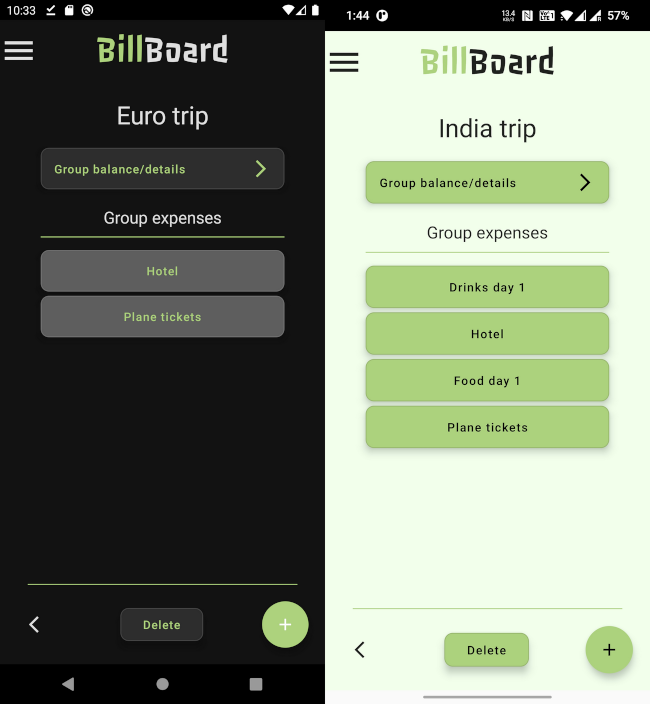
##
Group Drawer View - This hamburger menu allows the user to see the list of the group members and admins. If the user is an admin, he can access the Edit Member View and he can also leave the group by pressing the corresponding button.
##

##
Edit Member View - The user, that is an admin, can add a new member/admin to the group, edit a member's email, change his admin status and delete the member from the group. The current logged in user can't edit himself.
##
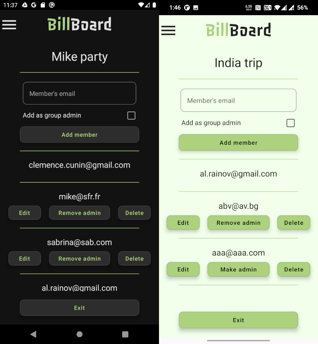
##
Group Balance View - The user can check the group balance. The total amount spent is displayed. Each members has a corresponding balance with other members names and amounts. The amount in red in a group balance, mean that the user has to pay to the member. An amount in green means that the member has to pay the user.
##
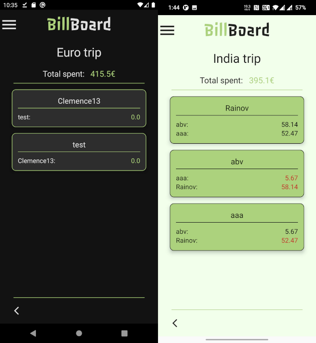
##
Expense View - Information for expense fetched from our database. Here the group admin can clear the debt of other users (for just a user or all of them), delete the expense, or edit it.
##

##
Add expense View  - Creating new expense. Same view is used for the editing of an existing expense
##
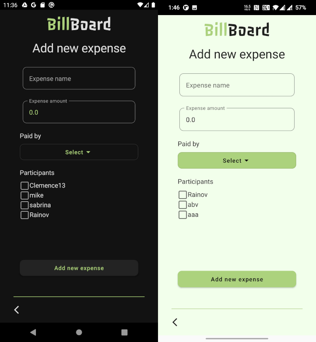
##
Add receipt View - Before uploading the user can see a preview of the selected image
##

##
Show receipt View - Display saved to firestore receipt picture for an expense
##
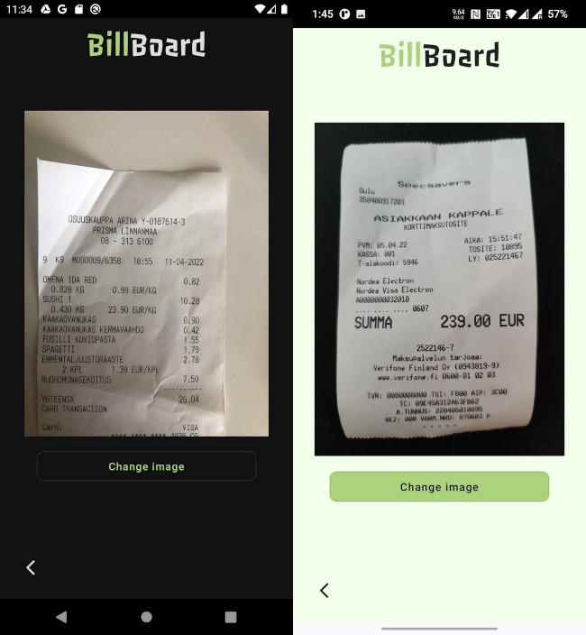

